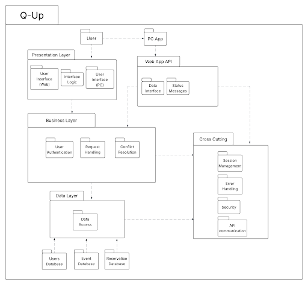
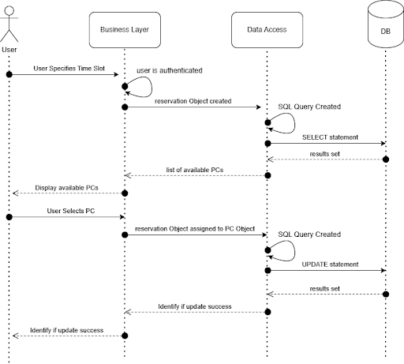

# Deliverable 5

---

## Description

The Q-Up system aims to provide a method of efficiently scheduling the use of computers at the NAU Advanced Media Lab. It consists of two parts: The Web App and the PC App that will be installed on the AML computers. The website allows users to create an account and view the E-Sport events that are taking place in the near future, as well as the reservations for a specific date and time. New users are added to the Users database. Similarly, when a reservation is scheduled or an ESports event is created, they are added to the Reservation and Event databases, respectively. The PC App communicates with the web server via an API that allows it to retrieve the reservations and associated information for the specific PC the software is installed on. The PC App then enforces the reservation by warning the player at specific intervals before the end of the session. Once the session is completed, the app will generate a full-screen pop-up to prompt the user to exit the game and honor the reservation.

---

## Architecture

### Diagram

*Refer to the UML package diagram below:*  

### Rationale

Q-Up’s architecture was designed using a layered and modular approach to ensure scalability, maintainability, and cross-platform compatibility. As a group, we decided to separate responsibilities across the Presentation, Business, Data, and Cross-Cutting layers. This allows for clearer organization and easier updates. The Presentation Layer was set up to support both Web and PC platforms with shared interface logic, while the Business Layer was set up to handle core functionalities like authentication and request handling. The architecture was also built to include separate databases for users, events, and reservations in order to promote data isolation and optimized access. The Cross-cutting Layer was set up to handle concerns like security, session management, and error handling, which are centralized to maintain consistency across the system. This structure enables Q-Up to be flexible, secure, and ready to scale with future needs.

---

## Class Diagrams

*Insert UML class diagram showing implementation-level classes here.*

> Note: Ensure to include visibilities, attribute types, method signatures, and associations.

---

## Sequence Diagrams

### Use Case 1: Reserving a PC

- **Actor:** User  
- **Trigger:** User selects available PC  
- **Precondition:** User must be logged in  
- **Postcondition:** PC is reserved for specified time slot (if successful); Restart process if unsuccessful  
- **Description:**  
  The user specifies the time they want to reserve the PC. The app displays the available PCs for that time, the user selects one, and the app makes the reservation for that specific PC.

---

## Design Patterns

### 1. Behavioral Pattern: Strategy

*Insert UML class diagram of the Strategy pattern here.*

- **Example Classes:**
  - `IWarningStrategy`: Interface for warning behavior
  - `TimeBasedWarning`: Sends warnings at set intervals
  - `UsageBasedWarning`: Sends warnings based on usage stats
  - `ReservationManager`: Uses a strategy object to manage warning behavior

- **GitHub Links:**
  - [`IWarningStrategy.java`](https://github.com/user/repo/blob/main/src/IWarningStrategy.java)
  - [`TimeBasedWarning.java`](https://github.com/user/repo/blob/main/src/TimeBasedWarning.java)
  - [`ReservationManager.java`](https://github.com/user/repo/blob/main/src/ReservationManager.java)

### 2. Structural Pattern: Facade

*Insert UML class diagram of the Facade pattern here.*

- **Example Classes:**
  - `ReservationSystemFacade`: Simplifies interaction between UI, authentication, and database
  - `UserAuthService`
  - `ReservationService`
  - `DatabaseAccessLayer`

- **GitHub Links:**
  - [`ReservationSystemFacade.java`](https://github.com/user/repo/blob/main/src/ReservationSystemFacade.java)
  - [`UserAuthService.java`](https://github.com/user/repo/blob/main/src/UserAuthService.java)
  - [`DatabaseAccessLayer.java`](https://github.com/user/repo/blob/main/src/DatabaseAccessLayer.java)

---

## Design Principles (SOLID)

The classes in our project follow the SOLID principles to promote clean, maintainable design:

- **Single Responsibility Principle:** Each class handles one concern only. For example, the `Reservation` class only stores reservation information, while the `PC` class contains data specific to the PC.
- **Open/Closed Principle:** Classes are open to extension but closed to modification. For example, new types of warning behaviors can be added without modifying the core `ReservationManager`.
- **Liskov Substitution Principle:** While inheritance is minimal currently, our design supports substituting subclasses (e.g., different types of reservations) without breaking functionality.
- **Interface Segregation Principle:** Interfaces are divided by purpose. We separate the user interface logic, request handlers, and PC App API into distinct interfaces to prevent bloated contracts.
- **Dependency Inversion Principle:** High-level modules rely on abstractions. The PC class does not depend on concrete reservation implementations—just on the presence of a reservation interface.

---
